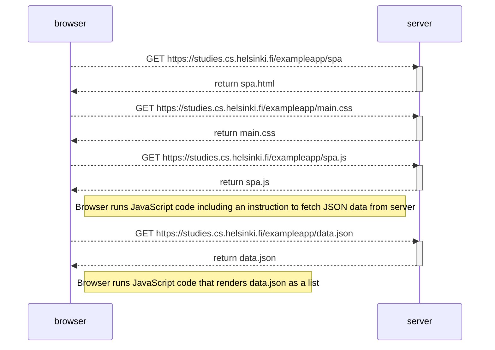

```mermaid
sequenceDiagram
    participant browser
    participant server

    browser-->>server: GET https://studies.cs.helsinki.fi/exampleapp/spa
    activate server
    server-->>browser: return spa.html
    deactivate server
    browser-->>server: GET https://studies.cs.helsinki.fi/exampleapp/main.css
    activate server
    server-->>browser: return main.css
    deactivate server
    browser-->>server: GET https://studies.cs.helsinki.fi/exampleapp/spa.js
    activate server
    server-->>browser: return spa.js
    deactivate server
    note right of browser: Browser runs JavaScript code including an instruction to fetch JSON data from server
    browser-->>server: GET https://studies.cs.helsinki.fi/exampleapp/data.json
    activate server
    server-->>browser: return data.json
    deactivate server
    note right of browser: Browser runs JavaScript code that renders data.json as a list
```
